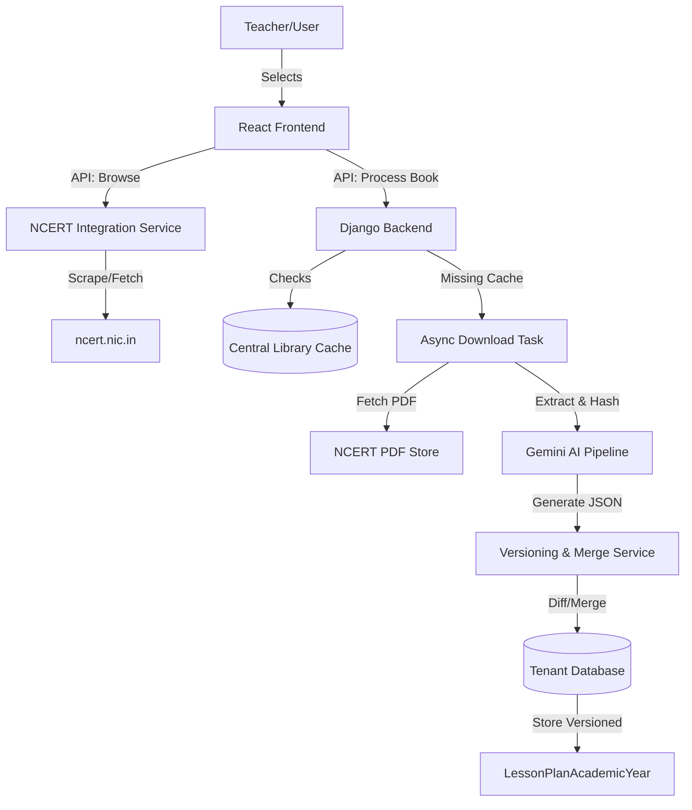

# Implementation Plan: Integrated NCERT Textbook Browsing & Versioned AI Lesson Planning

## 1. Executive Summary
This document outlines the architectural and implementation strategy for integrating official NCERT textbook browsing directly into the lesson planning module. Key objectives include eliminating manual PDF uploads, implementing a robust versioning system for data preservation, and ensuring a non-destructive merge between AI-generated content and teacher manual edits.

---

## 2. High-Level Architecture

---

## 3. Frontend UX/UI Flow

### A. Textbook Selection (New "NCERT Browser" Tab)
1.  **Tab Switcher:** Toggle between "Manual Upload" and "Official NCERT Library".
2.  **Dropdown Hierarchy:**
    *   **Class:** (1-12)
    *   **Subject:** (Dynamic based on Class)
    *   **Book:** (Dynamic based on Subject)
3.  **Visual Feedback:** Display book cover thumbnail (if available) and metadata (Title, Edition).
4.  **Action:** "Select & Preview" button triggers the background fetching process.

### B. Version Management UI
1.  **History Panel:** A sidebar or modal showing previous versions of the lesson plan.
2.  **Conflict Indicator:** Visual flags on subtopics that have been manually edited but have a "newer" AI version available.
3.  **Draft Mode:** Ability to preview a new AI generation as a "Draft" side-by-side with the current plan.

---

## 4. Backend Service Architecture

### A. NCERT Integration Service (`ncert_service.py`)
Responsible for communicating with the NCERT portal.
*   **Discovery:** Scrape `https://ncert.nic.in/textbook.php` to build the hierarchy.
*   **Resolution:** Map (Class, Subject, Book Name) to the unique 5-character `book_code`.
*   **Resource Mapping:** Generate predictable PDF URLs (e.g., `.../pdf/[book_code]ot.zip`).

### B. Versioning & Merge Service (`versioning_service.py`)
The core engine for data preservation.
*   **Snapshotting:** Serialize the current `LessonPlanAcademicYear` hierarchy into a JSON snapshot.
*   **Dirty Checking:** Identify records with `is_manually_edited=True`.
*   **Merge Strategy:**
    *   **Preservation:** If a record is manually edited, it is excluded from AI overwrites.
    *   **Synchronization:** If a record is untouched (pure AI), update it with the new generation.
    *   **Alignment:** Re-sequence topics if the new textbook structure differs significantly.

---

## 5. Database Schema Design

### New Model: `LessonPlanVersion` (Tenant DB)
Stores immutable snapshots of past plans.

| Field | Type | Description |
| :--- | :--- | :--- |
| `id` | UUID | Primary Key |
| `lesson_plan` | FK | Link to `LessonPlanAcademicYear` |
| `version_number` | Integer | Incremental version |
| `snapshot` | JSONField | Full serialized plan at that point in time |
| `change_summary` | TextField | E.g., "Regenerated from NCERT Book X" |
| `created_by` | FK | User who triggered the change |
| `created_at` | DateTime | Timestamp |

### Model Update: `LessonPlanSubtopicDetailAcademicYear`
Add tracking for manual modifications.

| Field | Type | Default | Description |
| :--- | :--- | :--- | :--- |
| `is_manually_edited` | Boolean | `False` | Set to `True` when a teacher saves changes |
| `last_ai_synced_at` | DateTime | `Null` | When this record was last updated by AI |

---

## 6. NCERT Scraping & Download Strategy

### Scraping Logic
Since NCERT doesn't provide an API, we use a hybrid approach:
1.  **Static Seed Data:** Hardcode the Class/Subject mapping (rarely changes).
2.  **Dynamic Discovery:** Use `requests` + `BeautifulSoup` to parse the `tbook` dropdown values on-the-fly to get `book_code`.
3.  **Caching Discovery:** Cache the Book hierarchy in `central_db` for 24 hours to avoid redundant scraping.

### Async Processing Workflow
1.  **Request:** User selects book -> Backend returns `task_id`.
2.  **Worker:**
    *   Download `ot.zip` or individual chapter PDFs.
    *   Validate PDF integrity (Header check, File size).
    *   **Content Hashing:** Compute SHA-256 of the PDF content.
    *   **Library Check:** Query `AiLessonPlanCache` by hash.
    *   **Process:** If MISS, run extraction and Gemini pipeline.

---

## 7. Versioning & Merge Strategy (Git-like)

To ensure manual work is NEVER lost, we implement a **Three-Way Merge** approach:

### Merge States
*   **BASE:** The previous AI generation that the teacher started with.
*   **LOCAL (Manual):** The current state in the tenant DB with teacher edits.
*   **REMOTE (New AI):** The newly generated AI plan.

### Decision Matrix for `SubtopicDetail`
| Manual Edited? | Content Changed in New AI? | Result Action |
| :--- | :--- | :--- |
| No | No | Keep current (No change) |
| No | Yes | **Update** with New AI content |
| Yes | No | **Keep Manual** content |
| Yes | Yes | **Conflict!** Keep Manual, flag for review. |

### Restore Functionality
Teachers can "Check Out" any previous version.
1.  Frontend sends `version_id`.
2.  Backend wipes current `LessonPlanTopicAcademicYear` records for that plan.
3.  Backend re-populates from `LessonPlanVersion.snapshot`.

---

## 8. API Endpoint Design

### Discovery APIs
*   `GET /api/v1/ncert/hierarchy/` -> Returns `[{class: 1, subjects: [...]}]`.
*   `GET /api/v1/ncert/books/?class=9&subject=Mathematics` -> Returns `[{title: "Beehive", code: "keec1"}]`.

### Processing APIs
*   `POST /api/v1/ai/process-ncert/`
    *   Payload: `{ book_code: "keec1", academic_year_id: 1, ... }`
    *   Behavior: Triggers async task, returns `task_id`.
*   `POST /api/v1/ai/merge-preview/`
    *   Payload: `{ cache_key: "...", merge_strategy: "preserve_manual" }`
    *   Returns: A diff object showing what will change, what will be preserved, and conflicts.

---

## 9. Edge Cases & Error Handling

| Edge Case | Strategy |
| :--- | :--- |
| **NCERT Site Down** | Fail gracefully with "NCERT portal unavailable; please upload PDF manually." |
| **PDF URL Changed** | Discovery service should re-parse the landing page to find new paths. |
| **Duplicate Textbooks** | Content-based hashing (SHA-256) ensures duplicates share the same cache entry. |
| **Mid-Year Switch** | Prompt teacher: "Preserve dates or reset timeline?". Default to preserving allocated dates. |
| **AI Timeout** | Retry with exponential backoff (max 3 retries). Use Gemini Pro for complex books. |
| **Large Files** | Stream extraction; do not load full 100MB PDF into memory. |

---

## 10. Security Considerations
1.  **Request Validation:** Ensure `book_code` passed to backend is validated against our whitelist to prevent SSRF (Server-Side Request Forgery).
2.  **Rate Limiting:** Limit NCERT scraping to 1 request per 5 seconds per worker to avoid IP blocking.
3.  **Sanitization:** AI-generated JSON must be schema-validated before merging to prevent DB corruption.

---

## 11. Implementation Phases

### Phase 1: NCERT Scraper & Discovery (Week 1)
*   Build the `NcertService`.
*   Implement hierarchy discovery and PDF URL generation.
*   UI: New "NCERT Library" tab with cascading dropdowns.

### Phase 2: Snapshot & Versioning (Week 2)
*   Implement `LessonPlanVersion` model and serialization logic.
*   Update UI to show "Last Saved" and "History".
*   Add `is_manually_edited` tracking to detail save endpoints.

### Phase 3: The Merge Engine (Week 3)
*   Develop the `MergeService` with conflict detection.
*   UI: "Merge Preview" screen showing diffs.
*   Integration: Connect NCERT download task to the versioning service.

### Phase 4: Hardening & Scaling (Week 4)
*   Error handling for NCERT downtime.
*   Background task monitoring (Celery/Redis).
*   Data migration: Populate `is_manually_edited=False` for all existing records.

---

## 12. Migration Strategy
1.  **Backward Compatibility:** The existing PDF upload endpoint remains functional and uses the same `MergeService`.
2.  **Data Patch:** Run a script to create an initial "Version 1" snapshot for all existing lesson plans.
3.  **Schema Update:** Deploy `is_manually_edited` field with a default of `False`. Any future manual save via the "Edit Lesson Plan" screen will flip this to `True`.

---

**Prepared by:** Senior AI Architect
**Status:** Ready for Review
**Date:** May 2026
